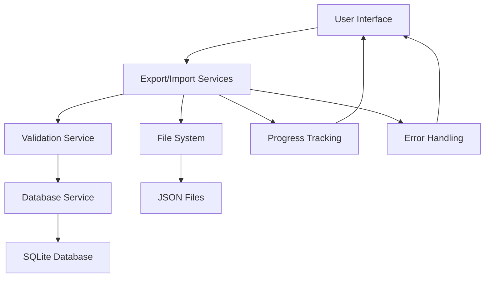

# Design Document

## Overview

This design document outlines the comprehensive data export/import system that will replace the limited product-specific functionality in ProductsManager.tsx with a centralized, user-friendly data management system. The solution focuses on providing granular control over data operations while maintaining excellent user experience and robust error handling.

## Architecture

### High-Level Architecture

```
┌─────────────────────────────────────────────────────────────┐
│                    User Interface Layer                     │
├─────────────────────────────────────────────────────────────┤
│  data-export.tsx  │  data-import.tsx  │  ProductsManager.tsx │
│  (Enhanced)       │  (Enhanced)       │  (Export/Import     │
│                   │                   │   Removed)          │
└─────────────────────────────────────────────────────────────┘
                              │
┌─────────────────────────────────────────────────────────────┐
│                   Service Layer                             │
├─────────────────────────────────────────────────────────────┤
│  DataExportService │ DataImportService │ ValidationService   │
│  - Export logic    │ - Import logic    │ - Data validation   │
│  - File generation │ - Batch processing│ - Integrity checks  │
│  - Progress tracking│ - Conflict resolution│ - Error handling │
└─────────────────────────────────────────────────────────────┘
                              │
┌─────────────────────────────────────────────────────────────┐
│                   Data Layer                                │
├─────────────────────────────────────────────────────────────┤
│              DatabaseService (services/database.ts)         │
│  - Products    │ Sales      │ Customers  │ Stock Movements  │
│  - Categories  │ Sale Items │ Expenses   │ Bulk Pricing     │
│  - Suppliers   │ Expense Categories      │ Enhanced Features │
└─────────────────────────────────────────────────────────────┘
```

### Data Flow Architecture



## Components and Interfaces

### 1. Enhanced ProductsManager Component

**Changes:**

- Remove export/import functionality
- Add navigation hints to data-export/data-import pages
- Simplify UI by removing export/import buttons
- Focus purely on product CRUD operations

**Interface:**

```typescript
interface ProductsManagerProps {
  compact?: boolean;
}

// Removed interfaces:
// - Export/Import progress interfaces
// - Export/Import handler functions
// - File system operations
```

### 2. Enhanced DataExportService

**Purpose:** Centralized service for all data export operations

**Interface:**

```typescript
interface DataExportService {
  exportProducts(): Promise<ExportResult>;
  exportSales(): Promise<ExportResult>;
  exportCustomers(): Promise<ExportResult>;
  exportExpenses(): Promise<ExportResult>;
  exportStockMovements(): Promise<ExportResult>;
  exportBulkPricing(): Promise<ExportResult>;
  exportCompleteBackup(): Promise<ExportResult>;

  // Progress tracking
  onProgress(callback: (progress: ExportProgress) => void): void;

  // File operations
  generateExportFile(data: any, filename: string): Promise<string>;
  shareExportFile(fileUri: string, title: string): Promise<void>;
}

interface ExportResult {
  success: boolean;
  fileUri?: string;
  filename?: string;
  recordCount: number;
  error?: string;
  metadata: ExportMetadata;
}

interface ExportProgress {
  stage: string;
  current: number;
  total: number;
  percentage: number;
  estimatedTimeRemaining?: number;
}

interface ExportMetadata {
  exportDate: string;
  dataType: string;
  version: string;
  recordCount: number;
  fileSize: number;
  checksum?: string;
}
```

### 3. Enhanced DataImportService

**Purpose:** Centralized service for all data import operations with conflict resolution

**Interface:**

```typescript
interface DataImportService {
  importProducts(
    fileUri: string,
    options: ImportOptions
  ): Promise<ImportResult>;
  importSales(fileUri: string, options: ImportOptions): Promise<ImportResult>;
  importCustomers(
    fileUri: string,
    options: ImportOptions
  ): Promise<ImportResult>;
  importExpenses(
    fileUri: string,
    options: ImportOptions
  ): Promise<ImportResult>;
  importStockMovements(
    fileUri: string,
    options: ImportOptions
  ): Promise<ImportResult>;
  importBulkPricing(
    fileUri: string,
    options: ImportOptions
  ): Promise<ImportResult>;
  importCompleteBackup(
    fileUri: string,
    options: ImportOptions
  ): Promise<ImportResult>;

  // Validation and preview
  validateImportFile(fileUri: string): Promise<ValidationResult>;
  previewImportData(fileUri: string): Promise<ImportPreview>;

  // Progress tracking
  onProgress(callback: (progress: ImportProgress) => void): void;

  // Conflict resolution
  resolveConflicts(
    conflicts: DataConflict[],
    resolution: ConflictResolution
  ): Promise<void>;
}

interface ImportOptions {
  batchSize: number;
  conflictResolution: 'update' | 'skip' | 'ask';
  validateReferences: boolean;
  createMissingReferences: boolean;
}

interface ImportResult {
  success: boolean;
  imported: number;
  updated: number;
  skipped: number;
  errors: ImportError[];
  conflicts: DataConflict[];
  duration: number;
}

interface DataConflict {
  type: 'duplicate' | 'reference_missing' | 'validation_failed';
  record: any;
  existingRecord?: any;
  field?: string;
  message: string;
}

interface ConflictResolution {
  action: 'update' | 'skip' | 'create_new';
  applyToAll?: boolean;
}
```

### 4. ValidationService

**Purpose:** Comprehensive data validation and integrity checking

**Interface:**

```typescript
interface ValidationService {
  validateProductData(product: any): ValidationResult;
  validateSalesData(sale: any): ValidationResult;
  validateCustomerData(customer: any): ValidationResult;
  validateExpenseData(expense: any): ValidationResult;
  validateStockMovementData(movement: any): ValidationResult;
  validateBulkPricingData(pricing: any): ValidationResult;

  // File validation
  validateFileFormat(fileContent: string): ValidationResult;
  validateDataStructure(data: any, expectedType: string): ValidationResult;

  // Reference validation
  validateReferences(
    data: any,
    existingData: DatabaseSnapshot
  ): ValidationResult;

  // Integrity checks
  checkDataIntegrity(data: any): ValidationResult;
}

interface ValidationResult {
  isValid: boolean;
  errors: ValidationError[];
  warnings: ValidationWarning[];
}

interface ValidationError {
  field: string;
  message: string;
  code: string;
  severity: 'error' | 'warning';
}
```

### 5. Enhanced UI Components

**DataExportPage:**

- Grid layout of export options with clear icons and descriptions
- Progress modal with detailed progress tracking
- Success/error handling with actionable messages
- File sharing integration

**DataImportPage:**

- File picker integration with format validation
- Import preview with data summary
- Conflict resolution interface
- Batch processing progress with pause/resume options

**ConflictResolutionModal:**

- Side-by-side comparison of conflicting data
- Bulk resolution options
- Field-level merge capabilities

## Data Models

### Export Data Structure

```typescript
interface ExportData {
  version: string;
  exportDate: string;
  dataType:
    | 'products'
    | 'sales'
    | 'customers'
    | 'expenses'
    | 'stock_movements'
    | 'bulk_pricing'
    | 'complete';
  metadata: ExportMetadata;
  data: {
    products?: Product[];
    categories?: Category[];
    suppliers?: Supplier[];
    sales?: Sale[];
    saleItems?: SaleItem[];
    customers?: Customer[];
    expenses?: Expense[];
    expenseCategories?: ExpenseCategory[];
    stockMovements?: StockMovement[];
    bulkPricing?: BulkPricing[];
  };
  relationships?: {
    productCategories: Map<number, number>;
    productSuppliers: Map<number, number>;
    saleCustomers: Map<number, number>;
    // ... other relationships
  };
  integrity: {
    checksum: string;
    recordCounts: Record<string, number>;
    validationRules: string[];
  };
}
```

### Import Processing Pipeline

```typescript
interface ImportPipeline {
  stages: ImportStage[];
  currentStage: number;
  totalStages: number;
}

interface ImportStage {
  name: string;
  description: string;
  processor: (data: any, options: ImportOptions) => Promise<StageResult>;
  validator?: (data: any) => ValidationResult;
  rollback?: (data: any) => Promise<void>;
}

enum ImportStageType {
  FILE_VALIDATION = 'file_validation',
  DATA_PARSING = 'data_parsing',
  STRUCTURE_VALIDATION = 'structure_validation',
  REFERENCE_VALIDATION = 'reference_validation',
  CONFLICT_DETECTION = 'conflict_detection',
  CONFLICT_RESOLUTION = 'conflict_resolution',
  DATA_IMPORT = 'data_import',
  INTEGRITY_CHECK = 'integrity_check',
  CLEANUP = 'cleanup',
}
```

## Error Handling

### Error Classification

1. **File Errors:**

   - Invalid file format
   - Corrupted file data
   - File access permissions

2. **Data Errors:**

   - Invalid data structure
   - Missing required fields
   - Data type mismatches

3. **Database Errors:**

   - Constraint violations
   - Reference integrity issues
   - Transaction failures

4. **System Errors:**
   - Memory limitations
   - Storage space issues
   - Network connectivity

### Error Recovery Strategies

```typescript
interface ErrorRecoveryStrategy {
  errorType: string;
  strategy: 'retry' | 'skip' | 'rollback' | 'user_intervention';
  maxRetries?: number;
  retryDelay?: number;
  userPrompt?: string;
  recoveryAction?: () => Promise<void>;
}

interface ErrorHandler {
  handleExportError(error: ExportError): Promise<ErrorResolution>;
  handleImportError(error: ImportError): Promise<ErrorResolution>;
  handleValidationError(error: ValidationError): Promise<ErrorResolution>;

  // Rollback capabilities
  createCheckpoint(): Promise<string>;
  rollbackToCheckpoint(checkpointId: string): Promise<void>;

  // User interaction
  promptUserForResolution(
    error: Error,
    options: ResolutionOption[]
  ): Promise<string>;
}
```

## Testing Strategy

### Unit Testing

- Service layer functions (export/import/validation)
- Data transformation utilities
- Error handling mechanisms
- File operations

### Integration Testing

- Database operations with real SQLite
- File system operations
- Progress tracking accuracy
- Conflict resolution workflows

### End-to-End Testing

- Complete export/import workflows
- Large dataset performance
- Error recovery scenarios
- User interface interactions

### Performance Testing

- Large dataset export/import (10k+ records)
- Memory usage optimization
- Batch processing efficiency
- Progress tracking accuracy

## Security Considerations

### Data Protection

- No sensitive data logging
- Secure file handling
- Temporary file cleanup
- Export file encryption options

### Validation Security

- Input sanitization
- SQL injection prevention
- File path traversal protection
- Data size limitations

### User Privacy

- No data transmission to external servers
- Local file storage only
- User consent for data operations
- Clear data usage policies

## Performance Optimization

### Export Optimization

- Streaming data processing for large datasets
- Chunked file writing
- Memory-efficient JSON serialization
- Background processing with progress updates

### Import Optimization

- Batch processing with configurable batch sizes
- Transaction optimization
- Index management during bulk operations
- Memory cleanup between batches

### UI Optimization

- Virtual scrolling for large data previews
- Debounced progress updates
- Lazy loading of conflict resolution data
- Responsive design for different screen sizes

## Migration Strategy

### Phase 1: Remove ProductsManager Export/Import

- Remove export/import buttons and handlers
- Update UI to focus on product management
- Add navigation hints to dedicated pages

### Phase 2: Enhance Export Functionality

- Implement DataExportService
- Enhance data-export.tsx with new features
- Add progress tracking and error handling

### Phase 3: Enhance Import Functionality

- Implement DataImportService and ValidationService
- Enhance data-import.tsx with conflict resolution
- Add batch processing and rollback capabilities

### Phase 4: Testing and Optimization

- Comprehensive testing with various data sizes
- Performance optimization
- User experience refinements

This design provides a robust, scalable, and user-friendly data management system that addresses all the requirements while maintaining excellent performance and reliability.
