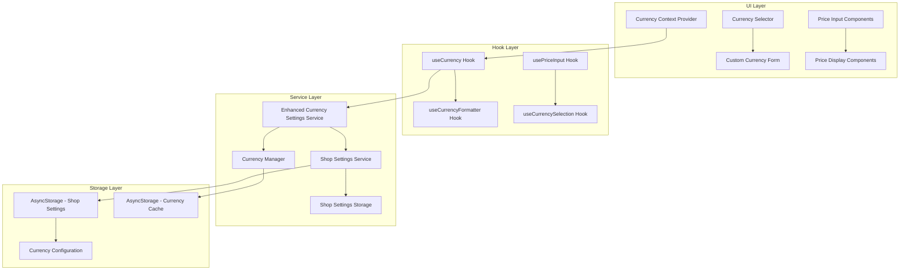
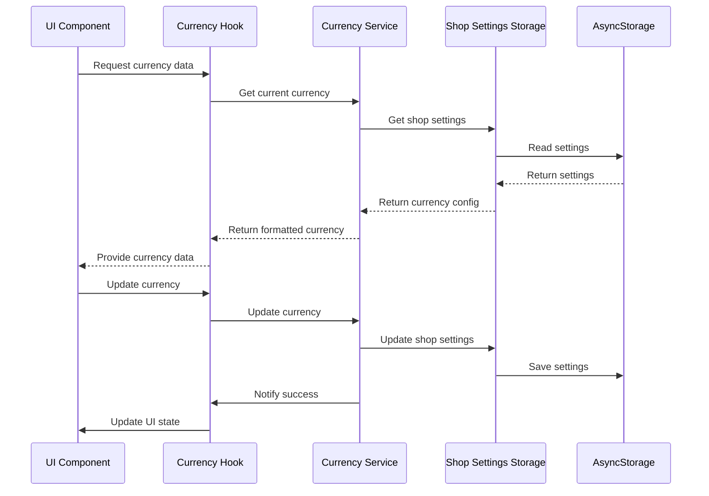

# Design Document

## Overview

This design document outlines the enhanced currency management system that provides unified storage integration, consistent UI components, and comprehensive custom currency support. The system builds upon the existing currency infrastructure while addressing integration gaps and consistency issues.

The enhanced system will centralize currency management through the shop settings storage, provide a unified currency context, and ensure consistent formatting across all application components.

## Architecture

### High-Level Architecture



### Component Integration Flow



## Components and Interfaces

### Enhanced Currency Settings Service

The `CurrencySettingsService` will be enhanced to fully integrate with shop settings storage:

```typescript
interface EnhancedCurrencySettingsService {
  // Core functionality
  initialize(): Promise<void>;
  getCurrentCurrency(): CurrencySettings;
  updateCurrency(currency: CurrencySettings): Promise<void>;

  // Shop settings integration
  syncWithShopSettings(): Promise<void>;
  migrateFromLegacyStorage(): Promise<void>;

  // Validation and utilities
  validateCurrency(currency: CurrencySettings): ValidationResult;
  formatPrice(amount: number): string;
  parsePrice(priceString: string): number;

  // Custom currency management
  saveCustomCurrency(currency: CurrencySettings): Promise<void>;
  getCustomCurrencies(): CurrencySettings[];
  deleteCustomCurrency(currencyCode: string): Promise<void>;
}
```

### Unified Currency Context

A new currency context will provide centralized state management:

```typescript
interface CurrencyContextType {
  // Current state
  currentCurrency: CurrencySettings | null;
  isLoading: boolean;
  error: string | null;

  // Actions
  updateCurrency: (currency: CurrencySettings) => Promise<void>;
  resetToDefault: () => Promise<void>;

  // Formatting utilities
  formatPrice: (amount: number) => string;
  parsePrice: (priceString: string) => number;
  validatePriceInput: (input: string) => ValidationResult;

  // Custom currencies
  customCurrencies: CurrencySettings[];
  saveCustomCurrency: (currency: CurrencySettings) => Promise<void>;
  deleteCustomCurrency: (code: string) => Promise<void>;
}
```

### Enhanced Currency Selector Component

The currency selector will be enhanced with better UX and custom currency support:

```typescript
interface EnhancedCurrencySelectorProps {
  onCurrencyChange?: (currency: CurrencySettings) => void;
  showCustomCurrencies?: boolean;
  allowCustomCreation?: boolean;
  compact?: boolean;
}

interface CurrencySelectorState {
  showModal: boolean;
  showCustomForm: boolean;
  searchQuery: string;
  selectedCategory: 'predefined' | 'custom';
}
```

### Standardized Price Input Component

All price input components will use a standardized interface:

```typescript
interface StandardPriceInputProps {
  value: string;
  onValueChange: (value: string, numericValue: number) => void;
  placeholder?: string;
  disabled?: boolean;
  error?: string;
  showCurrencySymbol?: boolean;
  autoFormat?: boolean;
}
```

### Currency Display Components

Standardized components for displaying formatted prices:

```typescript
interface PriceDisplayProps {
  amount: number;
  showSymbol?: boolean;
  showCode?: boolean;
  style?: 'default' | 'compact' | 'detailed';
  color?: string;
}

interface PriceRangeDisplayProps {
  minAmount: number;
  maxAmount: number;
  separator?: string;
}
```

## Data Models

### Enhanced Currency Settings

```typescript
interface CurrencySettings {
  code: string;
  symbol: string;
  name: string;
  decimals: number;
  symbolPosition: 'before' | 'after';
  thousandSeparator: string;
  decimalSeparator: string;

  // Enhanced fields
  isCustom?: boolean;
  createdAt?: string;
  lastUsed?: string;
}
```

### Shop Settings Integration

```typescript
interface ShopSettings {
  shopName: string;
  address?: string;
  phone?: string;
  logoPath?: string;
  receiptFooter?: string;
  thankYouMessage?: string;
  receiptTemplate: string;

  // Enhanced currency integration
  currency: CurrencySettings;
  customCurrencies?: CurrencySettings[];

  lastUpdated: string;
}
```

### Currency Storage Schema

```typescript
interface CurrencyStorageSchema {
  // Current active currency
  activeCurrency: CurrencySettings;

  // Custom currencies created by user
  customCurrencies: CurrencySettings[];

  // Cache for performance
  formattingCache: {
    [key: string]: string;
  };

  // Migration tracking
  migrationVersion: number;
  lastMigration?: string;
}
```

## Error Handling

### Currency Validation Errors

```typescript
interface CurrencyValidationError {
  field: keyof CurrencySettings;
  message: string;
  code: string;
}

interface ValidationResult {
  isValid: boolean;
  errors: CurrencyValidationError[];
  warnings?: string[];
}
```

### Error Recovery Strategies

1. **Invalid Currency Settings**: Fallback to default MMK currency
2. **Storage Corruption**: Attempt recovery from backup, then reset to defaults
3. **Migration Failures**: Rollback to previous version and log error
4. **Network Issues**: Use cached currency data
5. **Validation Failures**: Provide specific field-level error messages

### Error Boundaries

```typescript
interface CurrencyErrorBoundaryState {
  hasError: boolean;
  error: Error | null;
  errorInfo: string | null;
}

class CurrencyErrorBoundary extends React.Component<
  React.PropsWithChildren<{}>,
  CurrencyErrorBoundaryState
> {
  // Error boundary implementation for currency components
}
```

## Testing Strategy

### Unit Tests

1. **Currency Manager Tests**

   - Currency formatting with different settings
   - Price parsing and validation
   - Currency conversion utilities
   - Edge cases and error conditions

2. **Currency Service Tests**

   - Shop settings integration
   - AsyncStorage operations
   - Migration scenarios
   - Custom currency management

3. **Hook Tests**
   - Currency state management
   - Formatting utilities
   - Error handling
   - Performance optimization

### Integration Tests

1. **Currency Flow Tests**

   - End-to-end currency selection
   - Shop settings synchronization
   - Price display consistency
   - Custom currency creation

2. **Storage Integration Tests**
   - AsyncStorage persistence
   - Migration between versions
   - Data corruption recovery
   - Concurrent access handling

### Component Tests

1. **Currency Selector Tests**

   - Predefined currency selection
   - Custom currency creation
   - Search and filtering
   - Error state handling

2. **Price Input Tests**

   - Real-time validation
   - Format conversion
   - Error display
   - Accessibility compliance

3. **Price Display Tests**
   - Formatting consistency
   - Different currency types
   - Performance with large lists
   - Responsive design

### Performance Tests

1. **Formatting Performance**

   - Large number formatting
   - Repeated format operations
   - Memory usage optimization
   - Cache effectiveness

2. **Storage Performance**
   - AsyncStorage read/write speed
   - Migration performance
   - Concurrent operation handling
   - Memory leak detection

## Implementation Phases

### Phase 1: Core Infrastructure Enhancement

1. **Enhanced Currency Settings Service**

   - Integrate with shop settings storage
   - Implement migration from legacy storage
   - Add custom currency management
   - Enhance validation and error handling

2. **Unified Currency Context**
   - Create centralized currency context
   - Implement state management
   - Add error boundaries
   - Provide formatting utilities

### Phase 2: UI Component Standardization

1. **Enhanced Currency Selector**

   - Improve UX with search and categories
   - Add custom currency creation flow
   - Implement better error handling
   - Add accessibility features

2. **Standardized Price Components**
   - Create unified price input component
   - Implement consistent price display
   - Add validation and formatting
   - Ensure responsive design

### Phase 3: Integration and Consistency

1. **Component Migration**

   - Update all existing price components
   - Ensure consistent currency usage
   - Implement proper error handling
   - Add loading states

2. **Testing and Optimization**
   - Comprehensive test coverage
   - Performance optimization
   - Accessibility compliance
   - Documentation updates

### Phase 4: Advanced Features

1. **Enhanced Custom Currencies**

   - Currency templates
   - Import/export capabilities
   - Usage analytics
   - Backup and restore

2. **Performance Optimization**
   - Caching strategies
   - Lazy loading
   - Memory optimization
   - Background synchronization

## Migration Strategy

### Legacy Data Migration

```typescript
interface MigrationPlan {
  version: string;
  description: string;
  migrate: (oldData: any) => Promise<CurrencyStorageSchema>;
  rollback: (newData: CurrencyStorageSchema) => Promise<any>;
}

const migrations: MigrationPlan[] = [
  {
    version: '1.0.0',
    description: 'Migrate from separate currency storage to shop settings',
    migrate: async (oldData) => {
      // Migration logic
    },
    rollback: async (newData) => {
      // Rollback logic
    },
  },
];
```

### Data Validation During Migration

1. **Pre-migration Validation**

   - Check data integrity
   - Backup existing data
   - Validate migration requirements

2. **Migration Process**

   - Step-by-step data transformation
   - Validation at each step
   - Error handling and rollback

3. **Post-migration Validation**
   - Verify data integrity
   - Test functionality
   - Performance validation

## Security Considerations

### Data Protection

1. **Input Validation**

   - Sanitize all currency input data
   - Validate against injection attacks
   - Limit input lengths and formats

2. **Storage Security**
   - Encrypt sensitive currency data
   - Validate data integrity
   - Prevent unauthorized access

### Error Information Disclosure

1. **Safe Error Messages**

   - Avoid exposing internal details
   - Provide user-friendly messages
   - Log detailed errors securely

2. **Validation Feedback**
   - Clear validation messages
   - Prevent information leakage
   - Secure error reporting

## Performance Optimization

### Caching Strategy

1. **Format Caching**

   - Cache formatted price strings
   - Implement cache invalidation
   - Memory-efficient storage

2. **Currency Data Caching**
   - Cache predefined currencies
   - Lazy load custom currencies
   - Background refresh

### Rendering Optimization

1. **Component Memoization**

   - Memoize price display components
   - Optimize re-render triggers
   - Efficient prop comparison

2. **List Virtualization**
   - Virtual scrolling for currency lists
   - Lazy loading of currency data
   - Efficient search filtering

### Memory Management

1. **Resource Cleanup**

   - Proper cleanup of event listeners
   - Memory leak prevention
   - Efficient garbage collection

2. **Data Structure Optimization**
   - Efficient data structures
   - Minimal memory footprint
   - Optimized serialization
